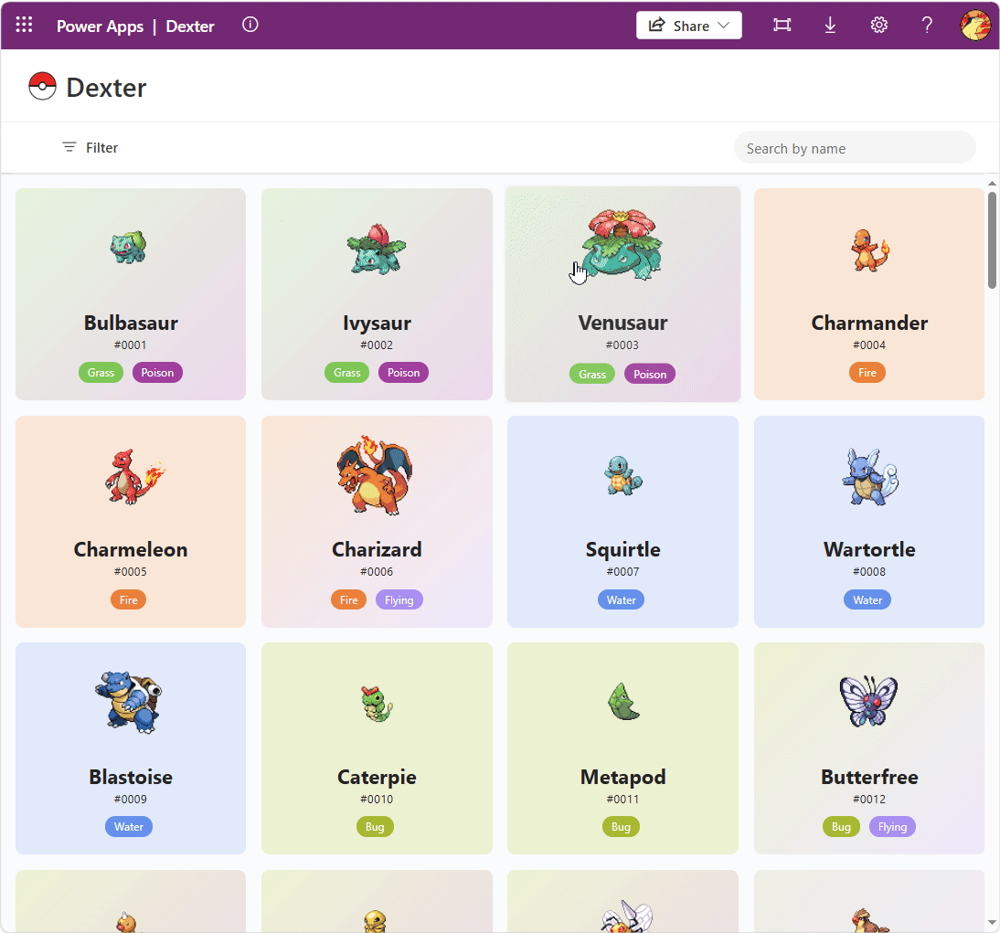
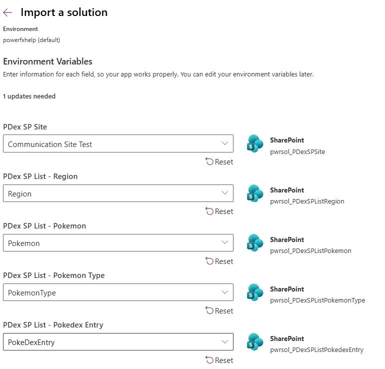

# Dexter - PowerApps Pokemon Pokedex!

## Description

Dexter is a Pokemon Pokedex Application using Microsoft Power Platform and data from the [PokeAPI](https://pokeapi.co/) cached to SharePoint. This project was created in order to explore a rich (and fun!) dataset from an API and build out a modern, clean design Canvas App in 2026. This app can help serve other makers and developers as inspiration and learning to apply some of the design techniques into their own projects and Power Apps.

**Key capabilities:**

1. Filter, Search, display detailed information about Pokemon
2. Fully responsive design for Desktop, Tablet, and Mobile form factors.

Stay tuned for future capabilities and enhancements to the solution!

## Technologies Used

## Prerequisites
 
1. An Office 365 License with PowerApps and SharePoint enabled
2. Access to Power Apps as an **Environment Maker** in the target environment
3. PowerShell Version 7 of Higher
4. The **SharePoint PnP PowerShell** module installed, along with an authenticated connection (e.g., via `Connect-PnPOnline`) with appropriate Azure AD permissions to run the provisioning scripts (Needed for SharePoint List creation and data import from PokeAPI). See [Register an Entra ID Application to use with PnP PowerShell](https://pnp.github.io/powershell/articles/registerapplication.html) for more information.
5. **Edit access** to a target SharePoint site

## Setup Instructions

### 1. Provision the SharePoint Lists

In command line, cd into the folder [`sharepoint-provision`]. Locate the script [`sharepoint-provision/SharePointParams.ps1`](./sharepoint-provision/SharePointParams.ps1) and replace the SiteURL variable with your site. Also, update the client id with your app registration authorized to use SharePoint. 

Next, run the [`sharepoint-provision/CreateLists.ps1`](./sharepoint-provision/CreateLists.ps1)

Note: If you are unable to use PnP PowerShell, the lists can also be created manually the column schemas are below:

#### Pokemon

| Field Title  | Internal Name | Required | Type      |
|---------------|---------------|----------|-----------|
| PokedexID     | PokedexID     | FALSE    | Number    |
| HeightInches  | HeightInches  | FALSE    | Number    |
| WeightLbs     | WeightLbs     | FALSE    | Number    |
| Types         | Types         | FALSE    | Text      |
| Color         | Color         | FALSE    | Text      |
| Type1         | Type1         | FALSE    | Text      |
| Type2         | Type2         | FALSE    | Text      |
| JapaneseName  | JapaneseName  | FALSE    | Text      |
| EnglishName   | EnglishName   | FALSE    | Text      |
| FrenchName    | FrenchName    | FALSE    | Text      |
| SpeciesID     | SpeciesID     | FALSE    | Number    |
| Region        | Region        | FALSE    | Lookup    |
| RegionID      | RegionID      | FALSE    | Number    |
| Sprite        | Sprite        | FALSE    | Thumbnail |
| CaptureRate   | CaptureRate   | FALSE    | Number    |
| GrowthRate    | GrowthRate    | FALSE    | Text      |
| SpriteShiny   | SpriteShiny   | FALSE    | Thumbnail |

#### PokeDexEntry

| Field Title | Internal Name | Required | Type   |
|-------------|---------------|----------|--------|
| PokedexID   | PokedexID     | FALSE    | Number |
| GameVersion | GameVersion   | FALSE    | Text   |
| Pokemon     | Pokemon       | FALSE    | Lookup |
| Data        | Data          | FALSE    | Note   |

#### PokemonType

| Field Title    | Internal Name  | Required | Type   |
|-----------------|-----------------|----------|--------|
| PokemonTypeId   | PokemonTypeId   | FALSE    | Number |

#### Region

| Field Title | Internal Name | Required | Type   |
|-------------|---------------|----------|--------|
| RegionId    | RegionId      | FALSE    | Number |
| Generation  | Generation    | FALSE    | Text   |

### 2. Import the Pokemon Data

Using the PowerShell script [`sharepoint-provision/ImportPkmn.ps1`](./sharepoint-provision/ImportPkmn.ps1), import the Pokemon data into the lists. Grab lunch or go on a long walk because this will take some time to run (the image upload part is slow) and took roughly 2.5 hours in total. It is a one-time run script.

### 3. Import the Solution
- Navigate to [make.powerapps.com](https://make.powerapps.com)
- Select the target environment
- Go to **Solutions** > **Import Solution**
- Upload the unmanaged solution `.zip` file and follow the import wizard
- When prompted, map the SharePoint site and list environment variables to the site and lists you created in Step 1

- Complete! Go to Apps and launch your shiny new app!